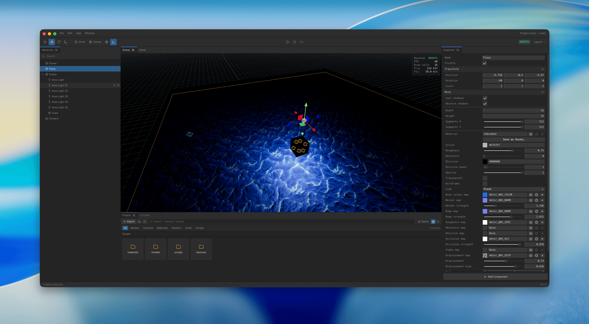

<div align="center">

# Three Studio

**A desktop 3D game editor — built on Three.js, React and Electron.**

[](#-project-status)
[](https://threejs.org)
[](https://electronjs.org)
[](https://react.dev)
[](https://www.typescriptlang.org)
[](https://rapier.rs)
[](https://vitest.dev)
[](LICENSE)

<!-- Screenshots -->


</div>

---

## ✨ What is it?

Three Studio is a **scene editor and game runtime for the web, running as a native desktop app**.
You open a project, drag models into a viewport, place lights, cameras, colliders and sounds,
attach TypeScript behaviours, press **Play** to test inside the editor — then **package the whole
thing as a static web build** that runs in any browser.

## 🚧 Project status

> **This is a proof of concept.** It is a personal R&D project: it runs, it edits, it plays, it
> exports — but it is **not production software**. Expect rough edges, missing features, breaking
> changes to on-disk formats between commits. Installers are published on the
> [Releases page](https://github.com/three-studio/three-studio/releases) but are **unsigned**, so
> macOS and Windows will both warn before letting them run. There is no support commitment and no
> stability guarantee.
>
> What it *is*: a serious, tested exploration of how much of a real game editor can live on top of
> Three.js and the web platform. 692 unit tests, strict package boundaries, and a headless smoke
> harness that boots the whole stack.

## 🧩 Features

### Editor shell
- **Two windows** — a launcher that picks a project, an editor that edits one.
- **Dockable panels** (dockview): Viewport, Game, Hierarchy, Inspector, Project, Console.
- **Saved layouts** — name a layout, restore it, reset to default.
- **Command registry** driving the menu bar, the toolbar and the keyboard shortcuts from one place.
- Toasts, modal/overlay stack, project settings, recent projects.

### Viewport
- **Fly camera** (`RMB` + `WASD`), orbit, pan, dolly, **frame selection**.
- **Transform gizmos** — select / move / rotate / scale, world or local space.
- **GPU picking**, selection outline, drop plane for drag-and-drop placement.
- Grid, sky/environment, light and audio markers.

### Scene & entities
- Full **scene graph**: parenting, grouping, reordering, visibility, lock.
- **Undo / redo** on every mutation, multi-selection, duplicate, delete.
- Multiple **scenes per project**, each versioned and migrated on load.
- **Prefabs**: make, instance, override per-instance, unpack.

### Components
`mesh` · `model` · `camera` · `light` · `collider` · `rigidbody` · `script` · `audioSource` ·
`audioListener` · `playerController` · `prefabInstance` · material assets

The Inspector is generated from a component's declared schema (Tweakpane), including asset pickers
and entity references.

### Assets & import pipeline
- **Formats**: glTF / GLB, FBX, OBJ, textures (PNG/JPG/WebP/KTX…), audio, JSON data.
- **Import dialog** with live preview — a turntable for models, a chequerboard for images, a
  waveform for sounds — plus destination browsing and per-format settings.
- **Unit fixing**: a model's bounding box is shown in the file's own units, with a **Fit to 1 m**
  button.
- **Nothing is written until you press Import** — the session lives in memory in the main process.
- **Stable ids in `.meta.json` sidecars**: scenes reference ids, never paths, so folders and assets
  can be renamed freely.
- **Import settings are read everywhere** — editor, play mode and exported build agree on scale,
  gain, mono downmix, colour space.

### Models
- **Unpack Model** — turn an imported file into one entity per node, addressed by child index so it survives re-imports.
- **Material override** per model or per unpacked piece, on top of what the file ships.

### Runtime
- **Three.js (WebGPU-capable) renderer**, ECS-ish system layer, resource arena, mesh batching.
- **Rapier physics**: rigid bodies, colliders, character-style player controller.
- **Play mode in-editor** with a document snapshot restored on stop — playing never dirties a scene.
- **Scripting**: user TypeScript compiled in-app by esbuild, with lifecycle hooks
  (`onAwake` / `onStart` / `onUpdate` / `onFixedUpdate` / `onLateUpdate` / `onDestroy`), declared
  editable properties (numbers, colours, vec3, enums, entity and asset pickers), and APIs for
  input, scenes, timers and audio.
- **Audio** (in progress): a hand-built Web Audio graph — 32-voice mixer with priority stealing,
  a continuous 2D↔3D `spatialBlend` dial, buses, per-window editor/game isolation.

### Export
- **Package for web** — copies the prebuilt player and adds the scenes, the assets and the compiled
  scripts. The output is a static folder you can drop on any host.
- **Base URL** — left empty, every URL stays relative to the page, which works at any address that
  ends in a slash. Set it (`/`, `/games/demo/`, `http://localhost:8080/`) and the exporter writes a
  `<base>` on the page, which moves the player bundle, the JSON, the assets and the scripts
  together. It is also the fix for a host that serves `/games/demo` without redirecting to
  `/games/demo/`, where relative URLs resolve one level too high.
- Build profiles, progress reporting, warnings surfaced in a toast.

---

## 🚀 Getting started (developers)

### Requirements

| | |
| --- | --- |
| **Node.js** | `>= 22.12` — repo is developed on `24.8.0`, see [`.nvmrc`](.nvmrc) |
| **npm** | 10+ (workspaces) |

### Install

```bash
git clone https://github.com/three-studio/three-studio.git
cd three-studio

nvm use          # Node 24.8.0
npm install      # workspaces + patch-package postinstall
```

> **`Error: Electron uninstall` on first run?** The Electron binary was not fetched by the
> postinstall hook. Get it manually:
> ```bash
> node node_modules/electron/install.js
> ```

### Run

```bash
npm run dev
```

This builds the web player once, starts electron-vite and opens the **launcher**. Create or pick a
project folder — the editor window opens on it, with renderer HMR live.

### Scripts

| Command | What it does |
| --- | --- |
| `npm run dev` | electron-vite dev server + Electron, renderer HMR |
| `npm run build` | Production build into `apps/desktop/out` |
| `npm run dist` | Build + package for **this** machine into `apps/desktop/release` |
| `npm run dist:mac` / `dist:win` / `dist:linux` | Same, targeting one platform explicitly |
| `npm run build:web` | Builds the exported-game player into `apps/web-template/dist` |
| `npm run build:packages` | Builds the three library packages for npm into `packages/*/dist` |
| `npm run typecheck` | `tsc --noEmit` across every workspace |
| `npm test` | Vitest (includes the package-boundary assertions) |
| `npm run test:watch` | Vitest in watch mode |

### Packaging

`npm run dist` packages for the machine it runs on. The per-platform variants exist for CI, and only
work there: `esbuild` is a *runtime* dependency — the packaged app compiles user scripts with it —
and npm installs only the current machine's binary, so `npm run dist:win` from a Mac produces an
installer that launches and then cannot compile a single script, with nothing failing along the way.

Releases therefore go through GitHub Actions, one native runner per target. One manual workflow in the
**Actions** tab — **Release** (`.github/workflows/release.yml`) — and nothing fires on a push.

Pick the branch under *Use workflow from*, type a tag name, run it. Any name git can store is allowed:
`v1.4.0`, `v1.4.0-rc.1`, `v2026-summer`. The run refuses a name git cannot store and one already taken,
then runs the typecheck and the suite at that commit, builds macOS arm64 + x64, Windows x64 and Linux
x64 on four native runners, tags the commit, and publishes a release with the installers attached —
marked **Pre-release** when the version carries a `-`.

Two things about that order are deliberate. **The tag is created last**, once all four installers
exist: a run that fails leaves the name free to try again rather than burning it on a commit that never
shipped. And **the run is dispatched from a branch**, because `workflow_dispatch` executes the workflow
file as it exists on the ref you pick — dispatch from a tag and you get the file that tag was cut with,
so a fix to the release process could never apply to the release that needed it.

The tag is the authority on the version: the release run stamps it into `apps/desktop/package.json` on
the runner, the one file electron-builder reads. `v1.4.0` therefore gives an app that reports `1.4.0`
and installers named `three-studio-1.4.0-…`, with no version to bump by hand. Nothing is committed —
the version in the repository stays `0.1.0` and only serves as the base for a tag that is not a version
number, which packages as a prerelease of it (`v2026-summer` → `0.1.0-2026-summer`).

### Headless smoke run

A blank window and a working window look identical in a build log, so the stack can boot itself and
report what the renderer actually painted:

```bash
STUDIO_SMOKE=1 npm run dev
STUDIO_SMOKE=1 STUDIO_SMOKE_SHOT=/tmp/shot.png npm run dev
```

Four more environment variables steer it, all read in
[`apps/desktop/src/main/smoke.ts`](apps/desktop/src/main/smoke.ts):

| | |
| --- | --- |
| `STUDIO_SMOKE_SHOT=<path>` | Also write a PNG of what was painted |
| `STUDIO_SMOKE_PROJECT=<path>` | Open this project instead of stopping at the launcher |
| `STUDIO_SMOKE_SETUP=<js>` | Run this in the renderer first, to drive the editor into the state worth looking at |
| `STUDIO_SMOKE_SETTLE=<ms>` | Wait longer than the default 800 ms after the setup before capturing |

---

## ⌨️ Controls

| Input | Action |
| --- | --- |
| Right button held | Mouse look; `WASD` to fly, `Q`/`E` down/up, `Shift` to boost |
| Wheel while looking | Adjust fly speed |
| Wheel | Dolly |
| Middle drag | Pan |
| `Alt` + left drag | Orbit the pivot |
| `F` | Frame the selection |
| `Q` `W` `E` `R` | Select / Move / Rotate / Scale |
| `Cmd/Ctrl` + `Z` / `Shift+Z` | Undo / redo |
| `Cmd/Ctrl` + `D` | Duplicate |
| `Delete` | Delete selection |

---

## 🏗️ Repository layout

```
packages/core        @three-studio/core — Pure data: scene schema, project schema, serialization, import contracts.
                     Depends on nothing — not three, not react, not node.
packages/runtime     @three-studio/runtime — The game engine: three.js + Rapier + audio + script host.
                     Never imports the editor.
packages/editor      @three-studio/editor — Editor UI: React shell, dock layout, viewport tooling, inspector, commands.
apps/desktop         Electron main / preload / renderer, import sessions, packaging.
apps/web-template    The player an exported game ships with.
```

Inside the monorepo the three packages are consumed as **TypeScript source**: Vite, electron-vite and
Vitest all alias `@three-studio/*` onto `packages/*/src`, mirroring the `paths` in
`tsconfig.base.json`. Nothing here reads a build.

They do have one, and it exists only for npm — `npm run build:packages` writes an ESM bundle and a
declaration tree into each `packages/*/dist`, which is what `npm publish` ships. It runs core →
runtime → editor, in that order: the build configs clear the root `paths`, so each package resolves
its siblings the way a consumer does.

Two Vitest assertions in `packages/runtime/test/package-boundary.test.ts` keep `core`
dependency-free and `runtime` editor-free.

## 🤝 Contributing

It's a POC, so the bar is simple: `npm run typecheck` and `npm test` both green, and a test that
would have caught the bug you fixed. Formats on disk are versioned — never remove a field, migrate
through the type's own factory, and leave unknown data untouched.

## 📄 License

[MIT](LICENSE). The three library packages — [`@three-studio/core`](packages/core),
[`@three-studio/runtime`](packages/runtime) and [`@three-studio/editor`](packages/editor) — are
published under the `@three-studio` npm scope as ESM with type declarations. `three`, `react` and
`react-dom` are peer dependencies, and a consumer has to alias `three` to `three/webgpu`: three's own
addons import the bare specifier, and a second copy of three makes every `instanceof` across the
boundary fail. Each package's README says what else it expects.

---

<div align="center">
<sub>Built with Three.js · Rapier · React · Electron · Vite · Tweakpane · dockview · Zustand</sub>
</div>
